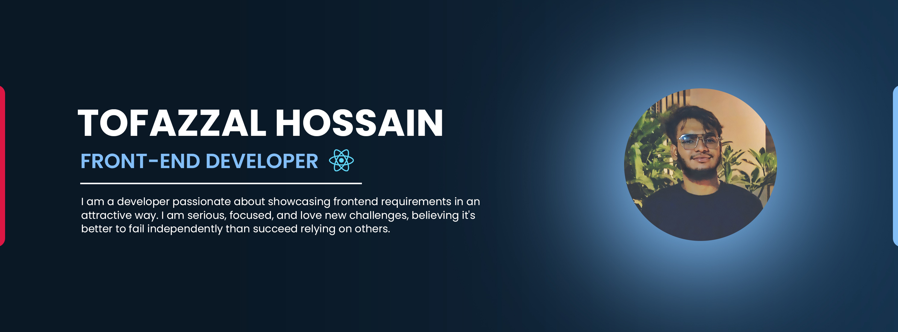

  

<h1 align="center">👋 Hello, I'm Tofazzal Hossain</h1>

 

  

<h2 align="center">🚀 About Me</h2>
As a developer I can demonstrate any frontend requirement in a beautifully attractive way. I am very
serious and focused in my work. I love to take new challenges. I think it's better to fail than to
succeed on the shoulders of others. Administered. Attained. Arranged I am a developer passionate about showcasing frontend requirements in an attractive way, I am serious, focused, and love new challenges believing it's better to fail independently than succeed relying on others.

<h3 align="center">Git Stats</h3>

 
  
   
   
 

<table>
  <tr>
    <td>
      
    </td>
    <td>
      
    </td>
    <td>
      
    </td>
  </tr>
</table>

### Top Repositories

  <table>
    <tr>
      <td>
        
      </td>
      <td>
        
      </td>
    </tr>
    <tr>
      <td>
        
      </td>
      <td>
        
      </td>
    </tr>
  </table>

 

<h2 align="center">🛠️ Tech Stack</h2>

<h3 align="center">Web Development</h3>

<table style="background-color: black; color: white; border: none; border-radius: 15px; overflow: hidden;">
  <thead>
    <tr>
      <th colspan="8" align="center" style="color: white;">Frontend</th>
    </tr>
  </thead>
  <tbody>
    <tr>
      <td align="center" style="border: none;">
        
         Next.js
      </td>
      <td align="center" style="border: none;">
        
         Tailwind CSS
      </td>
      <td align="center" style="border: none;">
        
         React
      </td>
      <td align="center" style="border: none;">
        
         TypeScript
      </td>
      <td align="center" style="border: none;">
        
         JavaScript
      </td>
      <td align="center" style="border: none;">
        
         jQuery
      </td>
      <td align="center" style="border: none;">
        
         HTML
      </td>
      <td align="center" style="border: none;">
        
         CSS
      </td>
    </tr>
  </tbody>
</table>

<table style="background-color: black; color: white; border: none; border-radius: 15px; overflow: hidden;">
  <thead>
    <tr>
      <th colspan="4" align="center" style="color: white;">Backend</th>
    </tr>
  </thead>
  <tbody>
    <tr>
      <td align="center" style="border: none;">
         Node.js
      </td>
      <td align="center" style="border: none;">
         Django
      </td>
      <td align="center" style="border: none;">
         Flask
      </td>
      <td align="center" style="border: none;">
         Express
      </td>
    </tr>
  </tbody>
</table>

<table style="background-color: black; color: white; border: none; border-radius: 15px; overflow: hidden;">
  <thead>
    <tr>
      <th colspan="4" align="center" style="color: white;">Database</th>
    </tr>
  </thead>
  <tbody>
    <tr>
      <td align="center" style="border: none;">
         MySQL
      </td>
      <td align="center" style="border: none;">
         MongoDB
      </td>
      <td align="center" style="border: none;">
         PostgreSQL
      </td>
      <td align="center" style="border: none;">
         Neo4j
      </td>
    </tr>
  </tbody>
</table>

<h3 align="center">Cloud Computing & DevOps</h3>

<table style="background-color: black; color: white; border: none; border-radius: 15px; overflow: hidden;">
  <thead>
    <tr>
      <th colspan="4" align="center" style="color: white;">Containerization & Orchestration</th>
    </tr>
  </thead>
  <tbody>
    <tr>
      <td align="center" style="border: none;">
         Docker
      </td>
      <td align="center" style="border: none;">
         Kubernetes
      </td>
      <td align="center" style="border: none;">
         Helm
      </td>
      <td align="center" style="border: none;">
         Skaffold
      </td>
    </tr>
  </tbody>
</table>

<table style="background-color: black; color: white; border: none; border-radius: 15px; overflow: hidden;">
  <thead>
    <tr>
      <th colspan="3" align="center" style="color: white;">Cloud Providers</th>
    </tr>
  </thead>
  <tbody>
    <tr>
      <td align="center" style="border: none;">
         Azure
      </td>
      <td align="center" style="border: none;">
         GCP
      </td>
      <td align="center" style="border: none;">
         AWS
      </td>
    </tr>
  </tbody>
</table>

<table style="background-color: black; color: white; border: none; border-radius: 15px; overflow: hidden;">
  <thead>
    <tr>
      <th colspan="2" align="center" style="color: white;">Infrastructure as Code</th>
    </tr>
  </thead>
  <tbody>
    <tr>
      <td align="center" style="border: none;">
         Terraform
      </td>
        <td align="center" style="border: none;">
         Ansible
       </td>
    </tr>
  </tbody>
</table>

<h3 align="center">AI/ML & Data Science</h3>

  <table style="background-color: black; color: white; border: none; border-radius: 15px; overflow: hidden;">
  <thead>
    <tr>
      <th colspan="5" align="center" style="color: white;">Languages & Libraries</th>
    </tr>
  </thead>
  <tbody>
    <tr>
      <td align="center" style="border: none;">
         Python
      </td>
      <td align="center" style="border: none;">
         NumPy
      </td>
      <td align="center" style="border: none;">
         Pandas
      </td>
      <td align="center" style="border: none;">
         TensorFlow
      </td>
      <td align="center" style="border: none;">
         PyTorch
      </td>
    </tr>
  </tbody>
 </table>

<table style="background-color: black; color: white; border: none; border-radius: 15px; overflow: hidden;">
  <thead>
    <tr>
      <th colspan="3" align="center" style="color: white;">Frameworks & Tools</th>
    </tr>
  </thead>
  <tbody>
    <tr>
      <td align="center" style="border: none;">
         LangChain
      </td>
      <td align="center" style="border: none;">
         Ollama
      </td>
  <td align="center" style="border: none;">
         LlamaIndex
      </td>
    </tr>
  </tbody>
</table>

<h3 align="center"> AI Tools & Prompt Engineering</h3>

 <table style="background-color: black; color: white; border: none; border-radius: 15px; overflow: hidden;">
  <thead>
    <tr>
      <th colspan="6" align="center" style="color: white;">AI Tools</th>
    </tr>
  </thead>
  <tbody>
    <tr>
      <td align="center" style="border: none;">
         ChatGPT
      </td>
       <td align="center" style="border: none;">
         Claude (Anthropic)
      </td>
      <td align="center" style="border: none;">
         Google Gemini
      </td>
      <td align="center" style="border: none;">
         Hugging Face
      </td>
      <td align="center" style="border: none;">
         Meta Llama
      </td>
      <td align="center" style="border: none;">
         Cohere
      </td>
    </tr>
  </tbody>
</table>

<h3 align="center">Streaming & Video Editing</h3>

<table style="background-color: black; color: white; border: none; border-radius: 15px; overflow: hidden;">
  <thead>
    <tr>
      <th colspan="2" align="center" style="color: white;">Streaming Platforms</th>
    </tr>
  </thead>
  <tbody>
    <tr>
      <td align="center" style="border: none;">
         Twitch
      </td>
      <td align="center" style="border: none;">
         YouTube
      </td>
    </tr>
  </tbody>
</table>

<table style="background-color: black; color: white; border: none; border-radius: 15px; overflow: hidden;">
  <thead>
    <tr>
      <th align="center" style="color: white;">Streaming Tools</th>
    </tr>
  </thead>
  <tbody>
    <tr>
      <td align="center" style="border: none;">
         OBS
      </td>
    </tr>
  </tbody>
</table>

<table style="background-color: black; color: white; border: none; border-radius: 15px; overflow: hidden;">
  <thead>
    <tr>
      <th colspan="3" align="center" style="color: white;">Video Editing Tools</th>
    </tr>
  </thead>
  <tbody>
    <tr>
      <td align="center" style="border: none;">
         Adobe Photoshop
      </td>
      <td align="center" style="border: none;">
         Adobe Premiere Pro
      </td>
      <td align="center" style="border: none;">
         Adobe After Effects
      </td>
    </tr>
  </tbody>
</table>

<h2 align="center">🏆 Featured Projects</h2>

<table align="center">
  <tr>
    <td align="center">
      
       
      <strong>AI-Powered Content Creation</strong>
       
      Automated content generation using various LLMs
    </td>
    <td align="center">
      
       
      <strong>MapleLaw AI</strong>
       
      Legal information assistant for Canadian citizens
    </td>
    <td align="center">
      
       
      <strong>Sara AI for Canadian Tire</strong>
       
      AI-enhanced shopping experience
    </td>
  </tr>
  <tr>
    <td align="center">
      
       
      <strong>4K60 Streaming Setup</strong>
       
      High-performance streaming with instant replay
    </td>
    <td align="center">
      
       
      <strong>Cloud-Native Web Apps</strong>
       
      Next.js, React, Django with Docker & Kubernetes
    </td>
    <td align="center">
      
       
      <strong>Your Next Project?</strong>
       
      Let's collaborate on something amazing!
    </td>
  </tr>
</table>

<h2 align="center">🎵 My Spotify Playlist</h2>

Explore my meticulously curated Spotify playlist, composed entirely of exceptional copyright-free music. It's perfectly suited for enhancing focus during coding sessions, fueling creativity, or simply unwinding. Each track has been selected to ensure an uninterrupted, high-quality audio experience.

<h5 align="center">Enjoy the tunes!</h5>

<h3 align="center">Top Artists of Playlist</h3>

  

  <table>
    <tr>
      <td>
        
      </td>
      <td>
        
      </td>
    </tr>
  </table>

  

    
View Data Card for Spotify

    
  

<h2 align="center">Support Me</h2>

  <table align="center">
    <tr>
      <th align="center">
        
      </th>
      <th align="center">
        
      </th>
      <th align="center">
        
      </th>
      <th align="center">
        
      </th>
    </tr>
    <tr>
      <td align="center">
        
      </td>
      <td align="center">
       
      </td>
      <td align="center">
        
      </td>
      <td align="center">
        
      </td>
    </tr>
  </table>

<h2 align="center">📫 Let's Connect!</h2>

<table align="center">
  <tr>
    <td colspan="3" align="center">
      
    </td>
    <td align="center">
      
    </td>
    <td align="center">
      
    </td>
  </tr>
</table>

 

<h3>

  
⭐️ From [KenanGain](https://github.com/KenanGain) | Let's innovate together! 🚀

</h3>

